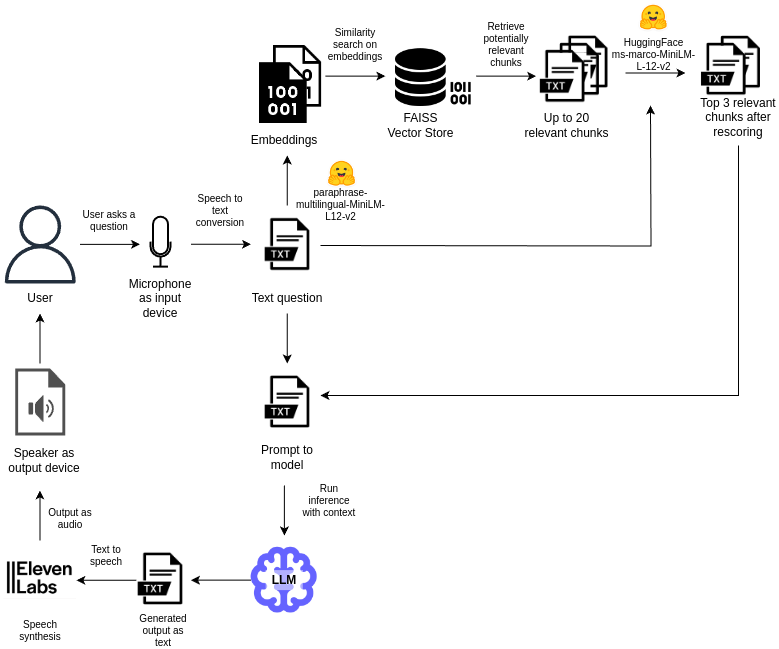

# How to Make Museums More Interactive? Case Study of Artistic Chatbot

This repository contains the source code and documentation for the paper "How to Make Museums More Interactive? Case Study of Artistic Chatbot," presented at CIKM 2025.

## Abstract

Conversational agents powered by Large Language Models (LLMs) are increasingly utilized in educational settings, particularly in individual closed digital environments. However, their potential adoption in physical learning environments—such as cultural heritage sites, museums, and art galleries—remains relatively unexplored. In this study, we present [*Artistic Chatbot*](https://github.com/cinekucia/Artistic-Chatbot/), a voice-to-voice RAG-powered chat system to support informal learning and enhance visitor engagement during a live art exhibition celebrating the 15th anniversary of the Faculty of Media Art at the Warsaw Academy of Fine Arts, Poland.

The question answering (QA) chatbot responded to free-form spoken questions in Polish using context retrieved from a curated, domain-specific knowledge base. Our findings, based on interaction analysis, demonstrate that chatbots such as *Artistic Chatbot* effectively maintain responses grounded in exhibition content (60% of responses directly relevant), even when faced with unpredictable queries outside the target domain, showing their potential for increasing interactivity in public cultural sites.

## Demo Video

A video demonstrating the chatbot in action at the exhibition is available **[here](https://www.dropbox.com/scl/fi/3ursmsloufobrt04ki1oi/Artistic_Chatbot_Demo_Video.mp4?rlkey=ybq30vrzlmglqgg0673xs3peq&st=ixo6omm7&dl=0)**.

---

## System Architecture

The system is built on a Retrieval-Augmented Generation (RAG) pipeline, which grounds the LLM's responses in a custom knowledge base, ensuring factual accuracy and relevance to the exhibition. The complete inference pipeline is shown below:

<p align="center">
  
</p>

### Knowledge Base Details

The chatbot's knowledge is grounded in a curated, domain-specific corpus provided by the exhibition organizers. This corpus includes faculty information, art magazines, books, and journals.

The corpus was segmented into smaller, overlapping chunks to facilitate effective retrieval. The maximum chunk size was set to **5,000 characters** with a **200-character overlap** to ensure contextual continuity between segments.


<div align="center">
  
### Corpus Statistics

<table>
<thead>
  <tr>
    <th>Metric</th>
    <th>Value</th>
  </tr>
</thead>
<tbody>
  <tr>
    <td colspan="2"><strong><em>Word Count Statistics</em></strong></td>
  </tr>
  <tr>
    <td>Number of documents</td>
    <td>226</td>
  </tr>
  <tr>
    <td>Mean number of words</td>
    <td>37,267.56</td>
  </tr>
  <tr>
    <td>Std dev</td>
    <td>51,906.03</td>
  </tr>
  <tr>
    <td>Min words</td>
    <td>58</td>
  </tr>
  <tr>
    <td>25th percentile words</td>
    <td>678</td>
  </tr>
  <tr>
    <td>Median words</td>
    <td>12,944.5</td>
  </tr>
  <tr>
    <td>75th percentile words</td>
    <td>60,441</td>
  </tr>
  <tr>
    <td>Max words</td>
    <td>479,111</td>
  </tr>
  <tr>
    <td>Total number of chunks</td>
    <td>11,596</td>
  </tr>
  <tr>
    <td colspan="2"><strong><em>Chunk Count per Document</em></strong></td>
  </tr>
  <tr>
    <td>Mean chunks</td>
    <td>51.31</td>
  </tr>
  <tr>
    <td>Median chunks</td>
    <td>19.5</td>
  </tr>
  <tr>
    <td>Std dev chunks</td>
    <td>70.07</td>
  </tr>
  <tr>
    <td>Min chunks</td>
    <td>1</td>
  </tr>
  <tr>
    <td>Max chunks</td>
    <td>650</td>
  </tr>
</tbody>
</table>

</div>

### User Interaction & Physical Setup

The chatbot was deployed in a live exhibition setting with a physical interface designed for public interaction. The setup included a ceiling-mounted microphone and multiple speakers to create an immersive, voice-first experience. Visitors could walk up to the microphone, ask questions in free-form Polish, and receive spoken answers from the chatbot, which adopted the persona of an artificial art curator.


---

## Getting Started

To run this project locally, follow these steps:

1.  **Clone the repository:**
    ```bash
    git clone https://github.com/cinekucia/Artistic-Chatbot.git
    cd Artistic-Chatbot
    ```

2.  **Set up a virtual environment:**
    ```bash
    python -m venv venv
    source venv/bin/activate  # On Windows, use `venv\Scripts\activate`
    ```

3.  **Install dependencies:**
    ```bash
    pip install -r requirements.txt
    ```

4.  **Set up API keys:**
    Create a `.env` file and add your API keys for services like OpenAI, ElevenLabs, etc.
    ```
    OPENAI_API_KEY="your_key_here"
    ELEVENLABS_API_KEY="your_key_here"
    ```

5.  **Run the application:**
    ```bash
    python Artistic_chatbot.py
    ```

## Citation

If you use this work, please cite our paper:

```bibtex
@inproceedings{kucia2025artistic,
  title={How to make museums more interactive? Case study of Artistic Chatbot},
  author={Kucia, Filip and Trochimiak, Szymon and Grabek, Bartosz and Wróblewska, Anna},
  booktitle={Proceedings of the 34th ACM International Conference on Information and Knowledge Management (CIKM '25)},
  year={2025},
  organization={ACM}
}
